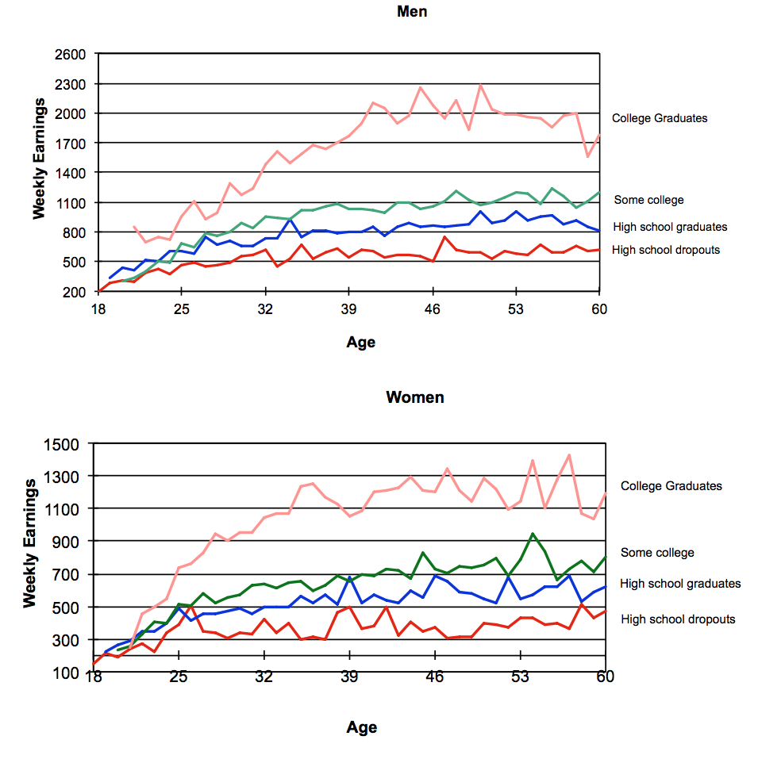

```{r}
library(ggplot2)
library(GGally)
library(ggpmisc)
library(dplyr)
library(knitr)
library(MASS)

# create dataframe
wages <- read.csv(file = "../data/cpswages.dat.txt", header = FALSE, sep=" ")
names(wages) <- c("EDUCATION",	"SOUTH", "SEX", "EXPERIENCE", "UNION",  "WAGE", "AGE", "RACE", "OCCUPATION", "SECTOR", "MARR")
wages = wages[,c(1,2,3,4,5,7,8,9,10,11,6)]

# Set up factors
wages$SOUTH <- factor(wages$SOUTH, levels=c(0,1),
                    labels=c('North','South'))

wages$SEX <- factor(wages$SEX, levels=c(0,1),
                    labels=c('Male','Female'))

wages$UNION <- factor(wages$UNION, levels=c(0,1),
                    labels=c('Non-Unionized','Unionized'))

wages$RACE <- factor(wages$RACE, levels=c(1,2,3),
                    labels=c('Other','Hispanic', 'White'))

wages$OCCUPATION <- factor(wages$OCCUPATION, levels=c(1,2,3,4,5,6),
                    labels=c('Management','Sales','Clerical','Service','Professional','Other'))

wages$SECTOR <- factor(wages$SECTOR, levels=c(0,1,2),
                       labels=c('Other','Manufacturing','Construction'))

wages$MARR <- factor(wages$MARR, levels=c(0,1),
                       labels=c('Unmarried','Married'))

wages$MANUFACTURING <- 1*(wages$SECTOR == 'Manufacturing')
wages$CONSTRUCTION <- 1*(wages$SECTOR == 'Construction')

wages$MANAGEMENT <- 1*(wages$OCCUPATION == 'Management')
wages$SALES <- 1*(wages$OCCUPATION == 'Sales')
wages$CLERICAL <- 1*(wages$OCCUPATION == 'Clerical')
wages$SERVICE <- 1*(wages$OCCUPATION == 'Service')
wages$PROFESSIONAL <- 1*(wages$OCCUPATION == 'Professional')

wages$WHITE <- 1*(wages$RACE == 'White')
wages$HISPANIC <- 1*(wages$RACE == 'Hispanic')

wages$ED_PLUS_EX <- wages$EDUCATION + wages$EXPERIENCE

women <- subset(wages,SEX=='Female')
men <- subset(wages,SEX=='Male')
```

## Introduction
In this paper we will be focusing around the impact of a worker's sex on their hourly wage. The dataset we are using for this project is a random sample of 534 people from the 1985 Current Population Survey (CPS) which contains cross-sectional data of potential determinants of wages. In this assignment we will use several statistical techniques we have acquired from our study combined with some real-world knowledge to try and answer some questions one may have about this dataset.

## Data Definitions

<<<<<<< HEAD
#head(wages)
```

##Introduction
  The Goal of our project is to see whether there is a wage gap in American society between males and females. We would like to study the different reasons on why there is a wage gap and would hope to find a answer to this wage gap. The data we used was provided by Dae Young of University of Massachusetts: Amherst Mathematics Associate Professor. The data was collected in 1985 and consist of a random sample of 534 people in the work force. The predictors that we used are
  
* *EDUCATION* : Number of years of education
* *SOUTH* : Indictor variable if a person is from the south or not
    0. Not From South
    1. From South
* *SEX* : Catagorical variable indiciting whether one was male or female
    0. Male
    1. Female
* *EXPERIENCE* : Number of years of work experience
* *UNION* : 
    0. Not in a Union
    1. In a Union
* *WAGE* : Wage earned per hour
* *AGE* : Age in year
* *RACE* : Catagorical variable indiciting ones race
    1. Other
    2. Hispanic
    3. White
* *OCCUPATION* : Catagorical variable indiciting ones occupation
    1. Management
    2. Sales
    3. Clerical
    4. Service
    5. Professional 
    6. Other
* *SECTOR* : Catagorical variable indiciting ones sector
    0. Other
    1. Manufacturing
    2. Construction
* *MARRIED* : Catagorical variable indiciting ones marriage status
    0. Unmarried
    1. Married
    
##Checking if there is a wage gap
```{r}
p <- ggplot( wages, aes ( x = SEX, y = WAGE) )
p + geom_boxplot() + ggtitle("Wage vs Sex")

* *EDUCATION* : Number of years of education
* *SOUTH* : Indictor variable if a person is from the south or not
    0. Not From South
    1. From South
* *SEX* : Catagorical variable indiciting whether one was male or female
    0. Male
    1. Female
* *EXPERIENCE* : Number of years of work experience
* *UNION* : 
    0. Not in a Union
    1. In a Union
* *WAGE* : Wage earned per hour
* *AGE* : Age in year
* *RACE* : Catagorical variable indiciting ones race
    1. Other
    2. Hispanic
    3. White
* *OCCUPATION* : Catagorical variable indiciting ones occupation
    1. Management
    2. Sales
    3. Clerical
    4. Service
    5. Professional 
    6. Other
* *SECTOR* : Catagorical variable indiciting ones sector
    0. Other
    1. Manufacturing
    2. Construction
* *MARRIED* : Catagorical variable indiciting ones marriage status
    0. Unmarried
    1. Married


## Does a "Wage Gap" Exist between Men and Women?
The first question we will attempt to answer is whether or not a wage gap exists between men and women. We can try to visualize the difference in male and female wages by using a box plot. From the figure below we can clearly see that the mean wage for men and women, denoted by the black line in each respective box, is unequal; on average men earn more than women.  
```{r echo=FALSE}
p <- ggplot( wages, aes ( x = SEX, y = WAGE) )
p + geom_boxplot() + ggtitle("Boxplot of Wage vs Sex")
```

A natural question to ask is, "Is this difference significant?" In order to answer this we must construct a statistical test. Since we have a relatively large sample, 245 women and 289 men, we will conduct a large sample hypothesis t-test with a 95% confidence interval.
```{r echo=FALSE}
cat(paste("Number of women: ", nrow(women), "\n","Number of men: ", nrow(men), sep = ""))
>>>>>>> Vic-NoteBook2
```

$$
H_o : \mu_{male} = \mu_{female}\\
H_a : \mu_{male}\geq\mu_{female}
$$
```{r echo=FALSE}
t.test(men$WAGE, women$WAGE, alternative = "greater")
```
<<<<<<< HEAD
Based on the results from using the T-test with the hypothesis test being $$H_o : \mu_{male} = \mu_{female}\\
H_1 : \mu_{male}\neq\mu_{female}$$
we would be to see that there is a wage gap as we reject our initial hypothesis and accept our alternative hypthoesis. This motivates us to move further in order to investigate why a wage gap exist and maybe solutions on how to fix this.
=======
Based on the results from our t-test we must reject the null hypothesis and accept the alternative hypothesis. In other words, the difference in the average wages between men and women is statistically significant. Men make ~\$10/hr on average and women make ~\$7.87 in 1985 dollars, in 2018 dollars this would be \$23.12/hr and \$18.21/hr respectively. Now that we have established that a statistically significant wage gap exists this motivates us to investigate why a wage gap between men and women exists. 

>>>>>>> Vic-NoteBook2

## Education and Wage Gap

Something that comes to mind when thinking of the determinants of wage is a person's level of education. Loosely speaking, one would expect that the more higher your level of education, the more money you will make. There is some empirical evidence behind this claim. If we look at data from the US BLS Annual Demographic Supplement of the CPS from 2013 we find that this is generally true for those above the age of 25. Also, interestingly, if we pay close attention to the scales of each axis, we find that the wage gap is still present.



In this study we will not be looking numerically at the data shown above, instead we will use it qualitatively for some intuition and partial justification for adding education into our multiple linear regression model. Before just wildly throwing a term into our model we can look at the marginal plot of wage versus number of years of education.

```{r echo=FALSE}
ggpairs(wages,columns = c("EDUCATION", "WAGE"), 
        lower = list(continuous=wrap("points", position="jitter")), 
        aes(colour=SEX)) + 
  ggtitle("Marginal Plot of Wage vs Education")
```

The focus of on this plot should be on the lower triangular elements. In the bottom left we have a scatterplot with jittered points with wage on the y-axis and number of years of education on the x-axis. In this scatterplot it is difficult to fully understand how many people have 12 years of education. The density plot in the top left roughly shows the percentage of the data for each level of education. To get an even better idea of this skew we found that 109 men and 110 women had exactly 12 years of education; combined, this accounts for a large part of our dataset, roughly 41%. In the bottom right we have a density plot for wages which isn't as interesting to us right now but it is worthy to note the skew in the wage distribution in this dataset. 

Our second hypthesis is people are paided proportional to their level of education which explains the reason for a wage gape between males and females. So if females and males have the same levels of education then a wage gap would not exist. 

The next questions we will attempt to tackle are, are people paid proportional to their level of education and is that proportion the same for men and women? In order to reason about this question we require two linear models. We will define our models as such:

$$
\begin{align}
M1: E(Wage|Education, Sex) &= \beta_{0,1} + \beta_{1,1} Education + \beta_{2,1} Sex \\
M2: E(Wage|Education, Sex) &= \beta_{0,2} + \beta_{1,2} Education + \beta_{2,2} Sex + \beta_{3,2} Sex:Education
\end{align}
$$

```{r echo=FALSE}
M1<-lm(WAGE~EDUCATION+SEX, data=wages)
M2<-lm(WAGE~EDUCATION+SEX+SEX:EDUCATION, data=wages)

cat(paste("Residual Standard Error for M1: ", round(sigma(M1),digits = 4), "\n",
          "Residual Standard Error for M2: ", round(sigma(M2),digits = 4), "\n",
          "Coefficient for interaction term: ",
          round(coef(M2)["EDUCATION:SEXFemale"],digits=4), "\n",
          "Confidence interval for coefficient of interaction term: ",
          list(round(confint(M2)["EDUCATION:SEXFemale",],digits=4)), "\n",
          "p-value for interaction term coefficient: ", 
          round(summary(M2)$coefficients[4,4],digits=4),
          sep = ""))

```

As we can see the RSE in both models is almost exactly the same, off by about 0.001. Using this information in conjunction with the fact that the confidence interval of the coefficient on the interaction term is not unambiguously positive or negative we can conclude that the interaction term is not signifcant so it is advisable to use one regression line for both men and women when trying to describe wage as a function of number of years of education. We can also see this lack of significance from the very large p-value. In the context of our problem this allows us to conclude that under a linear regression model that only includes education and sex to model wage the gender gap does not decrease as the level of education increases. However, what we do find is that the gender gap still exists and that men and women are not paid equally, proportionally to their level of education alone. We see this from looking at the SEXFemale coefficient in M1. The value of this coefficient is -2.124 and it has a 95% confidence interval (CI) of (-2.9154 -1.3327). Since $\beta_{2,1}$ is negative and both of the bounds of its 95% CI are negative this leads us to believe that there is a gender gap. In other words, we can say that under this model while adjusting for education on average women receive a lower wage than men by about 1.3 to 3 dollars per hour. (Not much evidence between one or two lines)

```{r include=FALSE}
coef(M1)
confint(M1)
```


## Adding Experience to Our Model

As it stands our model only uses sex and education as predictors. As we know from the real world, your wage might be related to the amount of experience you have had in a job. For example, more exclusive jobs normally pay more and the reason they may be exclusive is because they may require x years of experience. This allows us to hypothesize that your wage will depend upon the amount of experience you've had, more specifically, we would believe that your wage should increase with your level of experience. In order to justify adding this variable to our model we will create a separate model which attempts to model this new variable using the pre-existing regressors in our original model. We will then use this to construct an added variable plot for years of experience.

$$
\begin{align}
M3: E(Wage|Education, Sex, Experience) &= \beta_{0,3} + \beta_{1,3} Education + \beta_{2,3} Sex + \beta_{3,3} Experience \\
\end{align}
$$

```{r echo=FALSE}
M3 <- lm( EXPERIENCE ~ EDUCATION + SEX, data = wages)
```


```{r echo=FALSE}
resid_M1 <- resid(M1)
resid_M3 <- resid(M3)
fitted_M1 <- fitted(M1)

avp_df <- data.frame(resid_M1, resid_M3, fitted_M1)
ex_avp_mod <- lm(resid_M1 ~ resid_M3, data = avp_df)

f_vs_rs_M1 <- ggplot( avp_df, aes ( x = fitted_M1, y = resid_M1) ) 
f_vs_rs_M1 + geom_point() +
  ggtitle("Plot of Fitted vs Residuals for M1") + 
  xlab(expression(hat(y))) + 
  ylab(expression(paste(hat(e), "(M1)")))

p_added_v_edu_exp <- ggplot( avp_df, aes ( x = resid_M3, y = resid_M1) ) 
p_added_v_edu_exp + geom_point() +
  #geom_smooth(data=wages, method='lm',formula=y~x,color="pink") +
  geom_abline ( intercept = coef(ex_avp_mod)[1], slope = coef(ex_avp_mod)[2], color="blue" ) +
  ggtitle("Added Variable Plot for Experience") +
  xlab(expression(paste(hat(e), "(M3)"))) +
  ylab(expression(paste(hat(e), "(M1)")))

cat(paste("R squared value of regression on AVP for experience:",round(summary(ex_avp_mod)$r.squared,digits = 4)))
```

In the plot of the residuals versus the fitted values for M1 something of concern is that the variance is increasing as the number of years of education is increasing; we may return to this later. If we move on to the results of the added variable plot we see that almost 8% of the remaining variance in our model is explained by adding the variable for experience to our existing model. For our purposes this is a considerable amount because it increases our total explained variability by about 50%. This leads to actually defining our new model which includes experience:

$$
\begin{align}
M4: E(Wage|Education, Sex, Experience) &= \beta_{0,4} + \beta_{1,4} Education + \beta_{2,4} Sex + \beta_{3,4} Experience \\
\end{align}
$$

```{r include=FALSE}
M4 <- lm( WAGE ~ EDUCATION + SEX + EXPERIENCE, data = wages)
summary(M4)
```
<<<<<<< HEAD
Looking at the same graph above and adding regression lines we are able to see that there are other factors other than education which contributes to the wage gap. This helps to re-enforce a wage gap between male and female workers based on experience. 

##Looking for Collinearity
```{r}
pairs(wages[c(1,2,3,4,5,6,7)])
```
From using the pairs function we can see that experience and age have a high $R^2$ value of 0.95 which shows that they are collinear. This allows us to know before hand that creating a linear model with experience and age is not recommended and that we should transform our data before creating a linear model with both experience and age. 

##Education
\begin{align}
M1: E(Wage|Education, Sex) &= \beta_0 + \beta_1 Education + \beta_2 Sex\\
M2: E(Wage|Education, Sex) &= \beta_0 + \beta_1 Education + \beta_2 Sex + \beta_3 Sex*Education\\
\end{align}

```{r}
M1=lm(WAGE~EDUCATION+SEX, data=wages)
M2=lm(WAGE~EDUCATION+SEX+SEX:EDUCATION, data=wages)

summary(M1)
summary(M2)
```
From the results above we can see that Mod1 compared to Mod2 have a very similar residual standard error and from that we can conclude that fitting two different slopes are not justified. From mod1 to mod2 we can also see a slight bump in $R^2$ value, but not significant enough to draw a conclusion from. 

```{r}
M3 <- lm( EXPERIENCE ~ EDUCATION + SEX, data = wages)
M4 <- lm( WAGE ~ EDUCATION + SEX + EXPERIENCE, data = wages)
M5 <- lm( WAGE ~ SEX + EXPERIENCE, data = wages)

resid_wg_edu <- resid(M1)
resid_exp_edu <- resid(M3)
resid_wg_exp = resid(M5)


avp_ed_ex <- data.frame(resid_wg_edu, resid_exp_edu)
temp <- lm(resid_wg_edu ~ resid_exp_edu, data = avp_ed_ex)
p_added_v_edu_exp <- ggplot( avp_ed_ex, aes ( x = resid_exp_edu, y = resid_wg_exp) ) 
p_added_v_edu_exp + geom_point() +
  #geom_smooth(data=wages, method='lm',formula=y~x,color="pink") +
  geom_abline ( intercept = coef(temp)[1], slope = coef(temp)[2], color="blue" ) +
  ggtitle("Added Variable Plot for Experience") +
  xlab("Residuals of E[Experience|Education,Sex]") +
  ylab("Residuals of E[Wage|Education,Sex]")

summary(temp)$r.squared
summary(M4)
```
Based on the results from the added variable plot we see that 7% of experience explains wages in our model. This is a large percentage as there are many other factors which can explain wages in our dataset. This gives us a reason to add experience into our linear models. 

=======

If we examine this model we find that our residual standard error decreases from roughly 4.64 in M1 and M2 to 4.45 in M4. In real terms, this means that in either direction we are more accurate by about 15 cents per hour which equates to \$300/year in 1985 dollars (~$695 in 2018 dollars) assuming you work 40 hrs per week and take 2 weeks of vacation. (Why does our R^2 only increase by 0.2532 - 0.1884 = 0.0648 rather than 0.0798? Is it because education and experience are explaining the same thing?)

## Age and Collinearity

Another variable we have in our dataset is age. From the charts of the wage of differently educated people of each sex we see that along the x-axis we are looking at age. An alternative way we can interpret this is that as your age increases your earnings follow a somewhat logarithmic growth, by the shape of each line. Age is interesting because after age 18 your age doesn't really effect your wage that much, we would expect it to be more of your prior work experience and education. We can make a scatterplot matrix of the variables in this model with one special one. Will define a new variable EDU_PLUS_EXP which is defined to be the number of years of education of a person plus the number of years of experience a person has.

```{r echo=FALSE}
ggpairs ( wages, columns = c("EDUCATION","EXPERIENCE","AGE","ED_PLUS_EX", "WAGE") )
```

Let's try to analyze this plot a bit. If we start from the top left we find that education and experience are negatively correlated. Intuitively this makes sense, if you aren't going to school then you are spending time working to make money. Since the correlation is so strong and probably because the experience numbers are a little rough we see that no one is really unemployed, or are unemployed for a constant number of years. If we fit a model to this we find that the estimate for the intercept is about -6. Using our knowledge of the real world this most likely means that people didn't start schooling until they were about 6 years old and have since not had a year where they would be considered "unemployed." What we also find is that age and experience are highly correlated (correlation of 0.978) which makes sense because if you are not really ever unemployed you age should go hand in hand with the number of years of experience (just shifted). The really striking chart is that of the new variable on the y axis and age on the x axis; it is nearly a perfect line with a correlation of 1 when rounding to 4 decimal places. What this means is that, from the previous graph, experience and age are collinear, and that age, education, and experience are, almost, perfectly linearly dependent and are highly collinear. What this implies for our model is that if we were to add age when we are solving the normal equations for OLS we will have a rank deficient matrix and the coefficients on our other terms wouldn't really make sense if the coefficient for age were nonzero which it very well could be since it is a free variable. That being said since it is a free variable we can set it to zero or completely omit it from the model which accomplishes the same thing. It is for this reason we will not be including age in our model.

## Second Look at our Previous Models

In the spirit of showing our work we have explored our dataset pretty thoroughly so far however there was an obvious red flag in one of our charts which we didn't have the knowledge about because it is contained in chapter 8 and 9 in our textbook. If we look back at our fitted versus residuals plot of M1 recreated below there is an obvious problem. What we see is a rightward opening megaphone shape which implies non-constant variance and means that our model is not very good (in loose terms). Below the fitted versus residuals plot we show the same type of plot for M4 which is the model which includes experience and we see that the problem persists.

```{r echo=FALSE}
f_vs_rs_M1 + geom_point() +
  ggtitle("Plot of Fitted vs Residuals for M1") + 
  xlab(expression(hat(y))) + 
  ylab(expression(paste(hat(e), "(M1)")))

resid_M4 <- resid(M4)
fitted_M4 <- fitted(M4)

df_M4 <- data.frame(resid_M4, fitted_M4)

f_vs_rs_M4 <- ggplot( df_M4, aes ( x = fitted_M4, y = resid_M4) ) 
f_vs_rs_M4 + geom_point() +
  ggtitle("Plot of Fitted vs Residuals for M4") + 
  xlab(expression(hat(y))) + 
  ylab(expression(paste(hat(e), "(M4)")))
```

Something that seems reasonable to do is to transform our response variable, wages. We can begin to justify this by drawing and inverse fitted value plot for a given model.

```{r echo=FALSE}
fitted_M1 <- fitted(M1)
fitted_M4 <- fitted(M4)
inv_fitt_df <- data.frame(fitted_M1,fitted_M4, wages$WAGE)
inv_fitt_value_M1 <- ggplot( inv_fitt_df, aes ( x =wages.WAGE , y = fitted_M1) )
inv_fitt_value_M1 + geom_point()

inv_fitt_value_M4 <- ggplot( inv_fitt_df, aes ( x =wages.WAGE , y = fitted_M4) )
inv_fitt_value_M4 + geom_point()
```

By just looking at the graphs it seems like it would be worth while to use the logarithm of wages but we can be a bit more rigorous. By using the Box-Cox method we can determine the optimal transformation for our response variable. We will use R to compute the optimal $\lambda_y$ by sweeping over values (-2,2) for M4. 

```{r echo=FALSE}
bc <- boxcox(M4)
optimal_l <- bc$x[which.max(bc$y)]
```


Since our optimal $\lambda_y$ is essentially zero we can approximate the optimal transformation by using the logarithm of wage. We can see that once we take the logarithm, the wages are approximately normally distributed.

```{r echo=FALSE}
qplot(log(wages$WAGE), geom="histogram") + xlab("log(WAGE)")
```


Now that we have properly justified our usage of modeling log(WAGE) rather than wage let's now define two new models:

$$
\begin{align}
M5: E(log(Wage)|Education, Sex, Experience) &= \beta_{0,5} + \beta_{1,5} Education + \beta_{2,5} Sex + \beta_{3,5} Sex:Education
\end{align}
$$

```{r include=FALSE}
M5 <- lm( log(WAGE) ~ EDUCATION + SEX + EXPERIENCE, data = wages)
summary(M5)
```

Once we fit M5 we find that our residual standard error is now 0.4523 and our $R^2$ has increased from 0.2532 to 0.2696 when going from M4 to M5. At this point our model roughly reflects a famous econometric regression model: the Mincer Earnings Equation. The model is the same as M5 with an added term that represents $EXPERIENCE^2$ with another coefficient. For our final project we will explore this model more in depth and individually explore each occupation.

## Ignore bottom part, for future use


## Exploring Occupation

Now that we are accounting for a person's education and experience we can now try to explore the effect of a person's occupation on wage. Intuitively you can think to yourself, does a hamburger flipper make as much as a CEO of a major company; the answer is definitely not. We can apply at least some level of reasoning to this claim. Considering our current model, which accounts for education and experience, it is insufficient to claim that the CEO makes more than the hamburger flipper because the CEO has a PHD and the hamburger flipper didn't graduate high school nor is it sufficient to say that the CEO has had more experience nor is any combination of the prior two arguments. At this point we claim that the occupation you are in can determine your wage independently (enough) of education and experience. Some reasons may include the level of physical risk involved in job, for example, if there are two jobs that require the same level of education and experience and one job has a higher level of risk than the other, say a tree logger (one of the most dangerous jobs) and a cashier, we would expect the tree logger to earn more because his wage will compensate him for the additional risk he takes on. 


```{r echo=FALSE}
occ_table <- wages %>% 
  group_by(OCCUPATION,SECTOR) %>%
  summarise(Total = length(OCCUPATION),
            Male = length(subset(OCCUPATION,SEX=="Male")),
            Female = length(subset(OCCUPATION,SEX=="Female")),
            MeanWage = round(mean(WAGE),digits = 4),
            se = sd(WAGE))
kable(occ_table)
occ_table$OCC_SEC <- paste(substring(occ_table$OCCUPATION,1,4) ,substring(occ_table$SECTOR,1,4) )
occ_table
#kable(subset(occ_table,Total>=20))
ggplot(occ_table, aes(x=OCC_SEC,y=MeanWage)) +
  geom_errorbar(aes(ymin=MeanWage-se, ymax=MeanWage+se), width=.1) +
  geom_point() + 
  xlab("Abbreviated Occupation-Sector Combination") + 
  ylab("Mean Wage") +
  theme(axis.text.x = element_text(angle = 90, hjust = 1))
```


