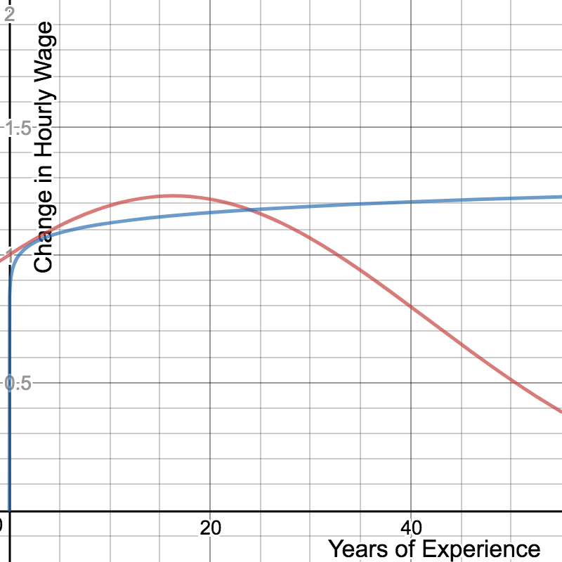

```{r include=FALSE}
library(ggplot2)
library(GGally)
library(ggpmisc)
library(dplyr)
library(knitr)
library(MASS)
library(gridExtra)
library(splines)
library(car)
# create dataframe
wages <- read.csv(file = "../data/cpswages.dat.txt", header = FALSE, sep=" ")
names(wages) <- c("EDUCATION",	"SOUTH", "SEX", "EXPERIENCE", "UNION",  "WAGE", "AGE", "RACE", "OCCUPATION", "SECTOR", "MARR")
wages = wages[,c(1,2,3,4,5,7,8,9,10,11,6)]

# Set up factors
wages$SOUTH <- factor(wages$SOUTH, levels=c(0,1),
                      labels=c('North','South'))

wages$SEX <- factor(wages$SEX, levels=c(0,1),
                    labels=c('Male','Female'))

wages$UNION <- factor(wages$UNION, levels=c(0,1),
                      labels=c('Non-Unionized','Unionized'))

wages$RACE <- factor(wages$RACE, levels=c(1,2,3),
                     labels=c('Other','Hispanic', 'White'))

wages$OCCUPATION <- factor(wages$OCCUPATION, levels=c(1,2,3,4,5,6),
                           labels=c('Management','Sales','Clerical','Service','Professional','Other'))

wages$SECTOR <- factor(wages$SECTOR, levels=c(0,1,2),
                       labels=c('Other','Manufacturing','Construction'))

wages$MARR <- factor(wages$MARR, levels=c(0,1),
                     labels=c('Unmarried','Married'))

wages$ED_PLUS_EX <- wages$EDUCATION + wages$EXPERIENCE
wages <- within(wages, OCCUPATION <- relevel(OCCUPATION, ref = "Other"))
# SECTOR doesn't need to be releveled 
# same with RACE

women <- subset(wages,SEX=='Female')
men <- subset(wages,SEX=='Male')
```


# Introduction

In this paper we will be focusing around the impact of a worker's sex on their hourly wage. The dataset we are using for this project is a random sample of 534 people from the 1985 Current Population Survey (CPS) which contains cross-sectional data of potential determinants of wages. In this assignment we will use several statistical techniques we have acquired from our study combined with some real-world knowledge to explore our dataset. 

# Data Definitions

* *EDUCATION* : Number of years of education
* *SOUTH* : Indictor variable if a person is from the south or not
    0. Not From South
    1. From South
* *SEX* : Categorical variable indiciting whether one was male or female
    0. Male
    1. Female
* *EXPERIENCE* : Number of years of work experience
* *UNION* : 
    0. Not in a Union
    1. In a Union
* *WAGE* : Wage earned per hour
* *AGE* : Age in year
* *RACE* : Categorical variable indiciting ones race
    1. Other
    2. Hispanic
    3. White
* *OCCUPATION* : Categorical variable indiciting ones occupation
    1. Management
    2. Sales
    3. Clerical
    4. Service
    5. Professional 
    6. Other
* *SECTOR* : Categorical variable indiciting ones sector
    0. Other
    1. Manufacturing
    2. Construction
* *MARRIED* : Categorical variable indiciting ones marriage status
    0. Unmarried
    1. Married


# Background Information on the Wage Gap
Something that comes to mind when thinking of the determinants of wage is a person's level of education. Loosely speaking, one would expect that the higher your level of education, the higher your hourly wage should be. There is some empirical evidence behind this claim. If we look at data from the US BLS Annual Demographic Supplement of the CPS from 2013 we find that this is generally true for those above the age of 25. Also, interestingly, if we pay close attention to the scales of each axis, we find that on average, controlling for education and sex, men make more than women on average.


In this study we will not be looking numerically at the data shown above, instead we will use it qualitatively for some intuition and partial justification for adding education into our multiple linear regression model. Before just wildly throwing a term into our model we can look at the marginal plot of wage versus number of years of education.

# Scatterplot Matrix

```{r fig2, echo=FALSE,, fig.width=7,fig.height=6,fig.cap="\\label{fig:figs} Scatterplot Matrix"}
# CHANGE M/F COLOR
pmat <- ggpairs(wages, columns = c("EDUCATION", "EXPERIENCE", "AGE", "SEX" ,"WAGE"), aes(colour=SEX))


for(i in 1:pmat$nrow) {
  for(j in 1:pmat$ncol){
    pmat[i,j] <- pmat[i,j] + 
        scale_color_manual(values=c("blue","pink")) + 
        scale_fill_manual(values=c("blue","pink"))  
  }
}
pmat
```


The dataset we chose has many factors and only a couple of continuous variables. Above, in Figure 2 we only use a few of the variables from our entire dataset. A few things pop out from the scatterplot matrix. Starting from the top left cell and looking down the main diagonal we see that men and women have similar distributions of levels of education, years of experience and age. We also see that our dataset contains about the same amount of men and women, 289 and 245 respectively. Looking at the bottom right cell we find that men and women have dissimilar wage distributions. In the box plot above this cell we clearly see that the median wage for men is higher than that of women. When looking at the marginal plots in the lower triangular region of the scatterplot matrix the two plots that stick out the most are those comparing *Age* vs. *Experience* and *Wage* vs. *Education*. We will explore these relationships more deeply and create models using statistical reasoning combined with real-world knowledge in attempt to explain wage gaps between men and women.

# Model 1: WAGE ~ EDUCATION + SEX
First, we would like to explore the existence of a wage gap when controlling for years of education. 

\begin{align}
M1: E(Wage|Education, Sex) &= \beta_{0,1} + \beta_{1,1} Education + \beta_{2,1} Sex
\end{align}

```{r fig3, echo=FALSE, fig.width=7,fig.height=6,fig.cap="\\label{fig:figs} Fitted Line of M1"}
M1<-lm(WAGE~EDUCATION+SEX, data=wages)
p <- ggplot(aes(x=EDUCATION, y=WAGE),data=wages)
p + geom_jitter(data=wages,aes(color=SEX)) + 
  geom_abline ( intercept = coef(M1)[1], slope = coef(M1)[2] ,color="black") +
  scale_color_manual(values=c("blue","pink")) +
  ggtitle("Marginal Plot of Wage vs Education")

summary(M1)
```

As we see in Figure 3 the model describes the positive relationship between *Wage* and *Education* as shown by the slope of the line, $\beta_{1,1} = 0.75128 > 0$. We also note that the confidence interval for this parameter is roughly (0.6, 0.9) which does not contain zero meaning that this parameter is significant. Under this model we also see that a wage gap between men and women is present. It is estimated that a women of will make \$2.12 ($\beta_{2,1}=-2.124$) per hour less than a man of similar education level. We note that the confidence interval for this estimate is (-2.915, -1.333) which again, does not contain zero and is significant. To wrap up this section, we will remember for the purposes of comparison later on that the $R^2$ for our "baseline" model is 0.1884.

# Model 2: WAGE ~ EDUCATION + SEX + SEX:EDUCATION

A question that seems reasonable is, does the wage gap between men and women decrease as the level of education for both groups increases? In order to explore this we create a new model with an interaction term between *Sex* and *Education*.

\begin{align}
M2: E(Wage|Education, Sex) &= \beta_{0,2} + \beta_{1,2} Education + \beta_{2,2} Sex + \beta_{3,2} Sex:Education
\end{align}


```{r}
M2<-lm(WAGE~EDUCATION+SEX+SEX:EDUCATION, data=wages)

p <- ggplot(aes(x=EDUCATION, y=WAGE),data=wages)
p + geom_jitter(data=wages, aes(color=SEX)) + 
  scale_color_manual(values=c("blue","pink")) +
  geom_smooth(method='lm', aes(color=SEX), data=wages)
```


In Figure 4 we can see the the fitted lines between men and women seem to have a different intercept but have roughly the same slope. To hammer this point down we find that the estimated coefficient for the interaction term has a confindence interval of (-0.136, 0.481) which contains zero and cannot be effectively relied upon. All of this information supports the argument that wage gap between men and women **does not** decrease as the number of years of education increases.


# Added Variable Plot: M1 and Experience

As it stands our model only uses sex and education as predictors. As we know from the real world, your wage might be related to the amount of experience you have had in a job. For example, more exclusive jobs normally pay more and the reason they may be exclusive is because they may require x years of experience. This allows us to hypothesize that your wage will depend upon the amount of experience you've had, more specifically, we would believe that your wage should increase with your level of experience. In order to justify adding this variable to our model we will create an added variable plot.

```{r echo=FALSE}
wages$resid_M1 = resid(M1)

avp1_mod <- lm(EXPERIENCE~EDUCATION + SEX, data=wages)
wages$resid_AVP1_x = resid(avp1_mod)
avp1_1 <- lm(resid_M1 ~ resid_AVP1_x, wages)

p <- ggplot(aes(x=resid_AVP1_x, y=resid_M1), data=wages)
p + geom_point() + 
  ggtitle("Added Variable Plot for EXPERIENCE") + 
  xlab('Residual of EXPERIENCE ~ EDUCATION + SEX') + 
  ylab('Residual of M1') + 
  geom_abline ( intercept = coef(avp1_1)[1], slope = coef(avp1_1)[2], color="blue" )

summary(avp1_1)
confint(avp1_1)
```

In the above added variable plot we see that there is a solid linear fit with a non-zero slope. The slope has a 95% CI of (0.081, 0.146) which doesn't contain zero and we also see that slope is non-zero by inspection of the graph. Also, by looking at the $R^2$ value of an OLS model fitted to this data we find that almost 8% of the remaining variance in our model is explained by adding experience to our existing model. For our purposes this is a considerable amount because it increases our total explained variability by about 50%. This leads to actually defining our new model which includes experience:


# Model 3: WAGE ~ EDUCATION + SEX + EXPERIENCE

\begin{align}
M3: E(Wage|Education, Sex, Experience) &= \beta_{0,3} + \beta_{1,3} Education + \beta_{2,3} Sex + \beta_{3,3} Experience \\
\end{align}

```{r include=FALSE}
M3 <- lm( WAGE ~ EDUCATION + SEX + EXPERIENCE, data = wages)
```

Looking at our new model we look back to our original question which is, does the wage gap between men and women still exist? According to M3 we found that the wage gap between men and women increased after we accounted for experience from $2.12 per hour to $2.34 per hour which opposed our initial assumptions. As usual, we found that the confidence interval for $\beta_{2,3}$ is (-3.0999,-1.5753) which does not contain zero and the p-value is << 0. Lastly, to compare for the purposes of comparison to previous and future models the $R^2$ of this model is 0.2532.


# Added Variable Plot: M3 and Age

Another variable in our data set we may want to consider is *Age*. *Age* may not directly influence your wage but it may influence other variables which directly influence your wage. This intuition combined with our observation of high correlation between *Age* and *Experience* from Figure 2 suggests that this variable may be collinear variables that already exist in our model. To further examine this we create an added variable plot.

```{r}
wages$resid_M3 = resid(M3)

avp2_mod <- lm(AGE ~ EDUCATION + SEX + EXPERIENCE, data=wages)
wages$resid_AVP2_x = resid(avp2_mod)
avp2_2 <- lm(resid_M3 ~ resid_AVP2_x, data=wages)

p <- ggplot(aes(x=resid_AVP2_x, y=resid_M3), data=wages)
p + geom_point() + 
  ggtitle("Added Variable Plot for AGE") + 
  xlab('Residual of  AGE ~ EDUCATION + SEX + EXPERIENCE') + 
  ylab('Residual of M3') + 
  geom_abline ( intercept = coef(avp2_2)[1], slope = coef(avp2_2)[2], color="blue" )

summary(avp2_2)
confint(avp2_2)
```
As we can see from the added variable plot adding *Age* to our model is not very helpful because a line might describe the data well if the outlier did not exist but the slope would infinite. In this case we see that the fitted line does not in fact describe the data well because of the outlier. The confidence interval for the slope is (-2.56,1.83) which contains zero so we cannot assert that the slope is non-zero. Futhermore, our $R^2$ is 0.0002036 which is nearly zero meaning that variance that age would explain is for the most part already explained by variables in the model.

# Collinearity 

From Figure 2 the only variables that seemed to be particularly collinear were *Age* and *Experience*. The previous added variable plot suggests there is collinearity between the variables *Education*, *Experience*, *Sex*, and *Age*. To nail down this relationship we define a new variable *ED_PLUS_EX* which is the number of years of education plus the number of years of experience for each person in our dataset. If we look at the marginal plot of *Age* vs. *ED_PLUS_EX* and fit a model we see that these variables are nearly perfectly collinear apart from one outlier. Intersetingly, the outlier seems to be a person who is 18 years old and has already finished four years of college.

```{r}
collin_mod <- lm(AGE ~ ED_PLUS_EX, wages)
p <- ggplot(data = wages , aes ( x = ED_PLUS_EX, y = AGE) )
p + geom_point() +
  geom_abline ( intercept = coef(collin_mod)[1], slope = coef(collin_mod)[2] ,color="black")
```

If we look at the fitted model we essentially see that $Age=6+1*(Education+Experience)$ which tells us something we should already know in the US. In the US most people begin their schooling, enter first grade, at around age 6. What we find is that for the rest of people's lives in our dataset people are either in school or working which makes sense because most people retire at 65 and the oldest person is 64 years old. To conclude our discussion of *Age* we have decided to not use it in our model because it would interfere with our existing variables in our model. However, we will note that since we have made this choice our estimate of the wage gap between genders may be underestimated because the amount of experience you have may be influenced by your gender; in this case women may have less experience than men because they may have to take time off from work to raise children. Since this is a subtle point and there is no data to support time off between genders in this case further discussion will be in the caveats section.


# Power Transformations

In order to find a better fit to the data we can try to add some non-linearity to our model without making our model non-linear. We do this using power transformations on the predictors and then on the response.

```{r}
wages$EXPERIENCE_P1 = wages$EXPERIENCE + 1
coef(powerTransform(wages[,c("EDUCATION","EXPERIENCE_P1")]), round=TRUE)
summary(powerTransform(wages[,c("EDUCATION","EXPERIENCE_P1")]))
```

The results from the power transformation suggests that we should not transform *Education* and that it is advisable to take the square root of *Experience* once we have adjusted the domain of *Experience* to be strictly greater than zero. In the real world this may be justified by diminishing returns to experience (see caveats). We can then use the Box-Cox Transformation to transform our response variable.

```{r}
wages$tranEXPERIENCE = wages$EXPERIENCE_P1^(1/2)
coef(powerTransform(WAGE~tranEXPERIENCE + EDUCATION + SEX, data=wages), round=TRUE)
```

Since our suggested value of $\lambda$ from the transformation is zero we will take the log of our response variable in our new model.

## Quickly Reaffirming Assumptions Made Before Power Transformations

The first thing we tried to justify in our study is that there was non-significant interaction between Education and Sex in M2. This may have not been the case had we used log(Wage) as our response. Here we have made a model which models the log(Wage) by Education and Sex and the interaction between Sex and Education and find that the interaction term is not really significant. This means that in our future models which use log(Wage) as the response we don't have to include this interaction term because the 95% confindence interval on the interaction term contains zero (-0.000732, 0.062341). Visually we can see this in a graph similar to <FIGURE M2> shown below; the slopes of the regression lines for men and women are about the same.


```{r}
M2_2 <- lm( log(WAGE) ~ EDUCATION + SEX + SEX:EDUCATION, data = wages)
summary(M2_2)
confint(M2_2)

p <- ggplot(aes(x=EDUCATION, y=log(WAGE)),data=wages)
p + geom_point(data=wages, aes(color=SEX)) + 
  geom_smooth(method='lm', aes(color=SEX), data=wages)
```

The other procedure we conducted was the choice to add Experience to our model. Here we will show that even when using the log(Wage) as our response we are justified in adding it to our model.

```{r}
tmp <- lm( WAGE ~ EDUCATION + SEX + SEX:EDUCATION, data = wages)
summary(tmp)

tmp <- lm( log(WAGE) ~ EDUCATION + SEX, data = wages)
wages$tmpr <- resid(tmp)

tmp2 <- lm( EXPERIENCE ~ EDUCATION + SEX, data = wages)
wages$tmp2r <- resid(tmp2)

p <- ggplot( wages, aes ( x = tmp2r, y = tmpr) ) 
p + geom_point()

tmp3 <- lm( tmpr ~ tmp2r, data = wages)
summary(tmp3)

```

The figure above is an added variable plot for Experience added to M1 where the response for M1 is log(Wage) instead of Wage. We find that the remaining variation explained is 9.517% which is an increase from roughly 8% from our findings in our initial added variable plot.

# Model 4: log(WAGE) ~ EDUCATION + SEX + sqrt(EXPERIENCE+1)

```{r}
M4<-lm(log(WAGE)~tranEXPERIENCE + EDUCATION + SEX, data=wages)
summary(M4)

#RSS_M4 <- sum((wages$WAGE - exp(fitted(M4)))^2)
#SYY <- sum((wages$WAGE - mean(wages$WAGE))^2)
#R2_M4 <- 1 - (RSS_M4 / SYY)
#R2_M4
```

In our new transformed model our definition of the wage gap between men and women changes. Our interpretation of the wage gap now becomes the percentage difference in wage between men and women adjusting for all other variables. In M4 we find that adjusting for *Education* and our new interpretation of *Experience* women make 25.79% less than men. As usual, for reference our $R^2$ for M4 is 0.2894 however we cannot compared this directly to the $R^2$ values of our previous models since we have taken the log.

While testing our models we found that in M4 we have finally solved our problem of non-constant variance (heteroscedasticity) which violates an assumption of linear models. We see this the plots of residuals versus fitted values. In residuals versus fitted values plot for model 3 we see an example of a right-opening megaphone:

```{r}
residualPlots(M3,terms = ~ 1)
```

However, in model 4 we find there is constant variance which means our model is valid.

```{r}
residualPlots(M4,terms = ~ 1)
```

## Mincer Earnings Function

At this point our model looks very similar to a prominent econometric model called the Mincer Earnings Function. The model is defined roughly as follows in [1]. 

\begin{align}
MEE: E(Wage|Education, Sex, Experience) &= log(w_0) + a Education + b Experience - c Experience^2 + \text{Other Variables}
\end{align}

In this case $w_0$ is the average wage a person in the reference group would expect to make. The coefficient a is interpretted as the average rate of return to schooling assuming workers are of equal ability. The coefficients b and c estimate the growth in earnings from an additional year of experience and are only greater than zero if it is assumed a worker invests in on-the-job-training. In short, since this isn't an economics paper, the squared term for experience comes from the idea that real post school investment in human capital decreases (assumed to be linearly decreasing) over the lifespan of the worker. This and the derivation of the Mincer Earnings Function is further described in [2].

For our purposes we will add Sex to our model.

```{r}
MEF<-lm(log(WAGE)~ EDUCATION + EXPERIENCE + I(EXPERIENCE^2) + SEX, data=wages)
summary(M4)
summary(MEF)
```

What we find is that our $R^2$ hardly increases compared to our M4, the power transformed model which uses the square root of experience, from 0.2894 to 0.2968. What we also find is that the coefficient on the experience squared term is significant and explains about 3% of the remaining variance compared to just using experience alone. The main difference between M4 and the MEF is the interpretation of the effect of experience on wages. If we look at a graph the change in hourly wage due to experience versus the amount of years of expereince the shape of the these graphs differs between these models as shown in the figure below. What ends up happening is that the rate of return to schooling remains about the same at 0.097740 in M4 and 0.0912936 in MEF and the wage gap remains almost exactly the same at about -0.25.




Since our models are very similar and the justification for the Mincer Earnings Function founded by us we will use M4 as the base model for expansion in the rest of this study.


# Model 5: log(WAGE) ~ EDUCATION + SEX + OCCUPATION + sqrt(EXPERIENCE+1)

Now that we are accounting for a person's education and experience we can now try to explore the effect of a person's occupation on wage. The justification for adding occupation into our model is that even after you account for all other variables in our model, a person's occupation may influence their wage. One way to think about this is that two jobs may require the same levels of education and experience but may incur different levels of risk of physical harm on the worker. Economic theory would suggest that the person who incurs more risk should make proportionally more money. This is just an example of how the type of occupation one takes can influence wage while controlling for our other variables. In M5 we explore the main effects model.

```{r echo=FALSE}
M5 <- lm( log(WAGE) ~ EDUCATION + tranEXPERIENCE + SEX + OCCUPATION, data = wages)
summary(M5)
```

Under this model we find that women make -22.7408% less than men while controlling for all of these factors. We also note that our $R^2$ increased to 0.3346 and our RSE slightly decreased to 0.4338.

# Model 6: log(WAGE) ~ EDUCATION + SEX * OCCUPATION + sqrt(EXPERIENCE+1)

```{r echo=FALSE}
M6 <- lm( log(WAGE) ~ EDUCATION + tranEXPERIENCE + SEX * OCCUPATION, data = wages)
summary(M6)
```

In model 6 
```{r}
p <- ggplot( wages, aes ( x = SEX, y = WAGE) )
p + geom_boxplot() + ggtitle("Wage vs Sex") + facet_wrap(~OCCUPATION)
```

```{r}
p <- ggplot( wages, aes ( x = SEX, y = log(WAGE)) )
p + geom_boxplot() + ggtitle("log(Wage) vs Sex") + facet_wrap(~OCCUPATION)
```

Notice that the coefficients on the interaction terms are the differences in the gaps with respect to the gap in occupation other. Notice that the only other bigger gap is in Sales, this is denoted by negative sign on the SexFemale:OccupationSales coefficient

# Adding Other Variables and Making New Models

```{r}
wages$resid_M5 <- resid(M5)
p <- ggplot( wages, aes ( x = UNION, y = resid_M5) )
p + geom_boxplot()
```

```{r echo=FALSE}
M6 <- lm( log(WAGE) ~ EDUCATION + tranEXPERIENCE + SEX*OCCUPATION + UNION, data = wages)
summary(M6)
```

```{r}
wages$resid_M6 <- resid(M6)
p <- ggplot( wages, aes ( x = SOUTH, y = resid_M6) )
p + geom_boxplot()
```


# Caveats and Final Notes


